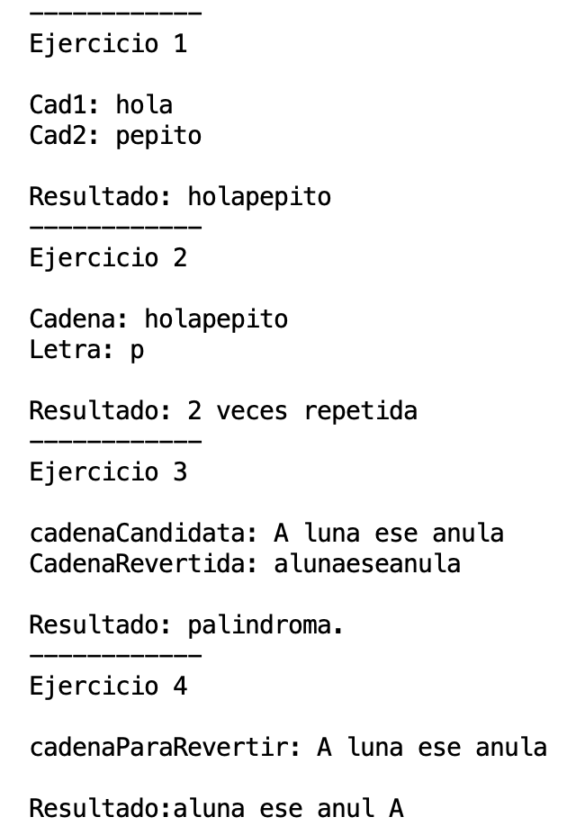
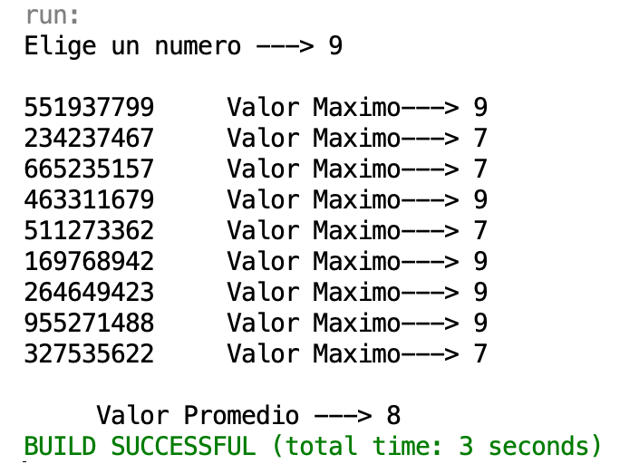

# PROG08

<style type="text/css">
    ol { list-style-type: lower-alpha; }
</style>

# 1. Operaciones con cadenas.
###### Funciones empleadas para resolver estos questiones.
1.  Reciba 2 cadenas y devuelve una cadena resultado de unir las dos anteriores.

```java
    static public String fusionarCadenas(String cad1, String cad2){
        
      String cadFusionada = null; 
        
        cadFusionada = cad1 + cad2;
                
       return cadFusionada;
    }
```

2. Reciba una cadena y una letra, y devuelva cuántas veces está dicha letra en la cadena.
```java
   static public int numeroRepeticiones(String cadena, char letra){
        
        int repeticiones = 0;
        char letraCadena;
        
        
        for (int i = 0;i< cadena.length(); i++)
        {
          letraCadena = cadena.charAt(i);
          
            if( letraCadena == letra)
              {
                repeticiones++;
              } 
        }
    
    
        return repeticiones;
    }
```


4. Reciba una cadena y diga si es palíndroma. (si tiene espacios/mayusculas se eliminan dentro del método, antes de decidir si es palíndroma)
```java
  static public boolean esPalindroma(String cadenaCandidata){
       
     boolean confirmacion = false;
     String CadenaRevertida = "";

     //Ponemos minusculas y quitamos espacios  
     cadenaCandidata = cadenaCandidata.toLowerCase().replaceAll(" ", ""); 

            
         for (int i = 1 ; i <= cadenaCandidata.length(); i++)
         {
             
           //Dividimos la palabra en letras y creamos otra palabra empezando por la ultima letra 
           CadenaRevertida += String.valueOf(cadenaCandidata.charAt(cadenaCandidata.length() - i));
         
              
         }
        
        //Si ambas palabras son iguales confirmamos
           
        if (CadenaRevertida.equals(cadenaCandidata) )
        {
        confirmacion = true;
        }
     
        return confirmacion;
    }
   
```

5. Reciba una cadena, y la devuelva girada, es decir al revés.

```java

     static public String RevertirCadena(String CadenaParaRevertir){
     
      String CadenaRevertida = "";
       
         for (int i = 1 ; i <= cadenaPararevertir.length() ; i++){
             
           CadenaRevertida += String.valueOf(CadenaParaRevertir.charAt(cadenaPararevertir.length() - i));
 
            
       }
     
        return CadenaRevertida;
     }
```
# Resultados

# 2. Operaciones con arrays unidimensionales.

##### Juego. Donde está la mosca.
Vamos a intentar cazar una mosca. La mosca será un valor que se introduce en una posición de un array de 8 posiciones.

##### Reglas.

1. En cada ronda, el jugador dirá una posición.
Si la mosca está en esa posición se acaba el juego.
>   - Se mostrará un mensaje dando la enhorabuena diciendo el número de rondas utilizadas.

2. Si la mosca no está en esa posición pueden ocurrir dos cosas:
>   - Que la mosca esté en casillas adyacentes a la casilla indicada por el jugador, en cuyo caso la mosca revolotea y se sitúa en otra casilla al azar (se le dice al jugador que la mosca ha revoloteado)
>   - Que la mosca no esté en casillas adyacentes, en este caso la mosca permanece donde está. (se le dice al jugador que la mosca sigue donde estaba y que elija otra posición)

3. Si en 5 rondas no se ha cazado,
> -  se termina la partida indicando al jugador que ha perdido.


```java
    
 while(menu){

         if(rondasTotales == 0)
         {                       
           System.out.println("Has perdido");
           menu = false;
           break;
         
         }
         
        posicionJugador = DecisionJugador(); // Numero elegido por el user
            
           for (int i=1 ; i <= tablero.length; i++) 
           { 
                      //Si el valor de la posicion iterada del tablero hace match en true hemos encontrado a la mosca
                     if (tablero[i] == true) 
                     {
                         System.out.println("");
                         
                         
                                //Si coincide con la posicion del jugador
                                if(i == posicionJugador ){ //Si el valor que ha facilitado el usuario es igual a la posicion del tablero gana el juego

                                    System.out.println("Has ganado");
                                    
                                    System.out.println("Mosca cazada en "+ (intentos) + " rondas " );


                                    menu=false;
                                    break;
                                  //Si no coincide pero es adyacente a la mosca
                                }else if( i == posicionJugador +1 | i == posicionJugador -1 ){ 

                                     System.out.println("Te has quedado cerca");
                                    
                                     //Desasignamos la posicion anterior 
                                     tablero[posicionMosca] = false;
                                     
                                     //Asignamos nueva posicion
                                     posicionMosca = PosicionMosca();
                                     tablero[posicionMosca] = true;
                                     
                                     System.out.println("La mosca ha revoloteado");
                                     System.out.println("");
                                     System.out.println("Nueva posicion: " + posicionMosca);
                                     System.out.println("");

                                 
                                }else{
                               
                                System.out.println("Fallaste");
                                System.out.println("");
                                
                        
                                }
                                
                                rondasTotales -= 1 ;
                                System.out.println("Rondas restantes :"+ (rondasTotales));
                                intentos++;
                                break;
                                
                                
                               
                     
                     }
                 
             }
  }

````

# Resultados


# 3. Operaciones Con Arrays Multidimensionales
Programa que lea una matriz de filas y columnas de numeros enteros del 1 al 9 de dimenension NxN, el usuario introduce N y el programa hace el resto. 
Posteriormente calculamos el valor maximo de cada fila y la media de los maximos.
```java
  int valorMaximo = 0;
  System.out.println("");

  for( int i = 0 ; i <= numeroUsuario-1 ; i++ )
  {  
                 for( int j : matriz[i] )
                 {
                     // Populamos las posiciones de la matriz 
                     matriz[i][j] = numeroAleatorio();

                     // Tomamos el valor de la posicion actual
                      int valorActual = matriz[i][j];
                      System.out.print(""+ matriz[i][j]);
                      
                     // Comparamos si el valor actual con el maximo
                          if(valorMaximo < valorActual )
                          {  
                              valorMaximo = valorActual ;
                          }
                 }
                 //Almacenamos en un array el valor maximo de la fila
                 System.out.println("     Valor Maximo---> "+valorMaximo);
                 valoresPromedio[i] = valorMaximo;
                 valorMaximo = 0;
}
          
          
            
                    
for( int valor : valoresPromedio)
{
  //Sumamos todos los valores maximos
  promedio += valor ;
}
                      //calculamos el promedio dividiendo la suma de todos los valores maximos entre el numero del usuario
promedio /= numeroUsuario;
System.out.println("");
         
System.out.println("     Valor Promedio ---> "+ promedio);
            
            
   }    
````
# Resultados


# 4. Operaciones con ArrayList
Sobre la clase CuerpoCeleste.java que creaste en la Unidad 6, crea un Lanzador, que pida al usuario cuerpos celestes, y que tendrán que irse almacenando en un ArrayList de CuerposCeleste.

No se sabe cuántos cuerpos quiere insertar el usuario, se irán guardando en el ArrayList, hasta que el usuario decida dejar de insertarlos. (la finalización o no, se le pregunta al usuario cada vez que inserta un Cuerpo) Una vez termine de insertar, se mostrarán todos los Cuerpos que se insertaron.

```java

   ArrayList<CuerpoCeleste> listaCuerpos = new ArrayList<>();
...
       if((nombre.isEmpty()) || (codigoCuerpo <= 0 )|| (tipoCuerpo.isEmpty()) || (diametro <= 0)) //controlamos que no haya datos en nulos
                    {
                     throw new NumberFormatException("Ningun dato puede ser nulo o negativo, vuelve a intentarlo");
                    }
                    else
                    {
                        //Construimos el objeto con la respuestas de las preguntas lo añadimos a la lista
                         listaCuerpos.add(new CuerpoCeleste(codigoCuerpo,nombre, tipoCuerpo, diametro));
                        
                           
                      }
                            boolean submenu = true;
                            while(submenu)
                            {
                                System.out.println("¿Deseas añadir mas cuerpos celestes? S,s o N,n ");

                                decision = dato.readLine();
                                

                                if("S".equals(decision) || "s".equals(decision) )
                                {
                                
                               
                                submenu=false;
                                break;

                                }
                                else if("N".equals(decision) || "n".equals(decision))
                                {
                                 //Listamos todos los cuerpos desde el primer hasta el ultimo index
                                    for (int i = 0 ; i < listaCuerpos.size() ; i++){
                                            
                                            System.out.println("Cuerpo celeste---> "+listaCuerpos.get(i));
                                            
                                          
                                    }
                                    
                                menu=false;
                                submenu=false;
                                break;
                                }
                                else
                                {
                                    System.err.println("Opcion invalida");
                                }
                           }
````

# Resultados:


# 5. Juego Master Mind

Escribe un programa que juegue al Rojo – Amarillo – Verde.

El programa genera tres dígitos aleatorios distintos entre 0 y 9.
> A estos dígitos se les asignan las posiciones 1, 2 y 3.

El objetivo del juego es adivinar los números y sus posiciones correctas en el menor número de intentos posibles.

Para cada intento el jugador proporciona tres números para las posiciones 1, 2 y 3.

El programa responde con una pista que consta de rojo, amarillo y verde:
> - Si un dígito está en la posición correcta, la respuesta es verde.
> - Si el dígito adivinado está en una posición incorrecta, la respuesta es amarillo.
> - Si el dígito no coincide con ninguno de los tres dígitos la respuesta es rojo.

Se darán 7 oportunidades para adivinarlo:
> * Si el jugador lo adivina, el programa dará la enhorabuena e indicará las rondas que ha tardado. 
> * Si no, el programa dirá que el jugador ha perdido y mostrará un mensaje de despedida.
> 

* * *


```java
       while(menu)
       { 
           
       System.out.println("");
       
       
               
       int[] PosicionesDelJugador = PosicionJugador(); //Preguntamos al jugador por 3 numeros
       solventado = 0;
       
            for (int i = 0 ; i < 3 ; i++)
            {
                encontrado = false;
                
                if( PosicionesDelJugador[i] == PosicionesDeLaMaquina[i]) //Si las posicion y valor son los mismos entre maquina y jugador devuelve verde  
                {
                         System.out.print(" Verde ");
                         solventado++; //Sumamos y seguimos hasta los 3 puntos para ganar
                         encontrado = true; //Decimos que lo hemos encontrado para no iterar mas
                         
                 }

                 if (encontrado == false)
                 {
                         for (int j = 0 ; j < 3; j++) //Ahora buscamos el valor de la misma posicion por las 3 posiciones de la maquina 
                         {
                             //Si el valor dado se encuentra en alguna de las posiciones de la maquina devuelve amarillo
                             if(PosicionesDelJugador[i] == PosicionesDeLaMaquina[j])
                             {
                                 System.out.print(" Amarillo ");
                                 encontrado = true;    
                             }
                         }
                        if (encontrado == false)
                        { //Si no hemos encontrado nada en ninguno de los 2 bucles anteriores devuelve rojo
                                 System.out.print(" ROJO ");
                        }   
                }
             }
            
                System.out.println("");
                System.out.println("Rondas restantes "+ (7 -rondasTotales));
              
              
                // Si hemos acertado 3 veces en el mismo turno el valor entre la maquina y el jugador ganamos
                // Si no hemos acertado y hemos llegado a la ronda 7 septima acabamos el juego
              
                if(solventado == 3)
                {
                    System.out.println("");
                    System.out.println("Enhorabuena has superado el reto en " + rondasTotales + " rondas");
                    break;
                }   
                else if (rondasTotales == 7){
                    System.out.println("Lo siento has agotado las rondas");
                    break;
                }
                
        rondasTotales++;
       }
````

# Resultado
